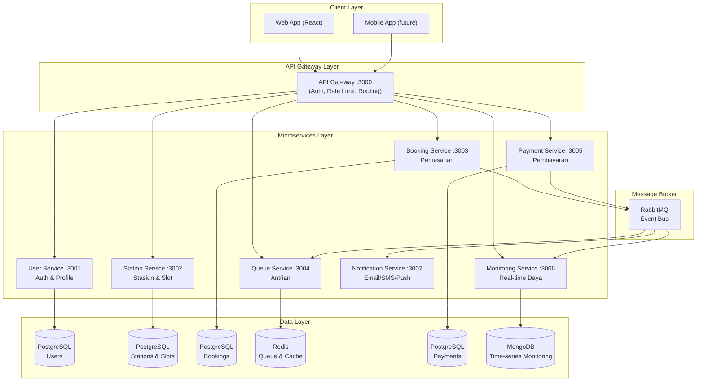

# EV Charging Booking System — Microservices Architecture

> **Peran: Arsitek Sistem**  
> Merancang arsitektur, diagram C4, ADR, dan menjaga konsistensi desain seluruh sistem.

---

## Deskripsi Proyek

Sistem pemesanan slot pengisian daya kendaraan listrik (EV) berbasis **Microservices**. Pengguna dapat:

- **Pesan Slot** — pilih stasiun pengisian, pilih slot waktu, dan konfirmasi booking
- **Antre** — bergabung ke antrian digital jika slot penuh
- **Bayar** — pembayaran digital terintegrasi (QRIS/Transfer/e-Wallet)
- **Pantau Daya** — real-time monitoring daya, persentase baterai, dan estimasi waktu selesai

---

## Arsitektur Tingkat Tinggi



---

## Struktur Proyek

```
ev-charging-booking/
├── README.md                    # File ini
├── ARCHITECTURE.md              # Detail arsitektur
├── docs/
│   ├── architecture/            # Diagram C4 (Context, Container, Component, Sequence)
│   ├── adr/                     # Architecture Decision Records
│   └── api/                     # OpenAPI/Swagger specifications
├── services/
│   ├── api-gateway/             # API Gateway (Node.js + Express-http-proxy)
│   ├── user-service/            # Auth & manajemen pengguna
│   ├── station-service/         # Manajemen stasiun & slot
│   ├── booking-service/         # Pemesanan slot
│   ├── queue-service/           # Antrian digital (Redis)
│   ├── payment-service/         # Pembayaran & invoice
│   ├── monitoring-service/      # Real-time power monitoring (WebSocket)
│   └── notification-service/    # Notifikasi (Email/SMS/Push)
├── frontend/                    # React + TypeScript + Tailwind CSS
└── infrastructure/
    ├── docker-compose.yml       # Orkestrasi development
    ├── docker-compose.prod.yml  # Orkestrasi production
    └── nginx/                   # Reverse proxy config
```

---

## Tech Stack

| Layer | Teknologi |
|---|---|
| Frontend | React 18, TypeScript, Tailwind CSS, React Query, Socket.io-client |
| API Gateway | Node.js, Express, http-proxy-middleware, JWT |
| Services | Node.js 20, Express.js, Sequelize (PostgreSQL), Mongoose (MongoDB) |
| Message Broker | RabbitMQ (amqplib) |
| Cache / Queue | Redis (ioredis) |
| Database | PostgreSQL 15, MongoDB 7, Redis 7 |
| Real-time | Socket.io (WebSocket) |
| Auth | JWT (RS256), bcrypt |
| Container | Docker, Docker Compose |
| Reverse Proxy | Nginx |
| Logging | Winston, Morgan |
| Validation | Joi |

---

## Cara Menjalankan

### Prerequisites
- Docker Desktop (>= 24.x)
- Node.js 20 LTS (untuk pengembangan lokal)
- Git

### Development (Docker)

```bash
# Clone project
git clone <repo-url>
cd "Kelompok Microservices Design and Implementation"

# Jalankan semua service
cd infrastructure
docker-compose up -d

# Cek status service
docker-compose ps
```

### Akses Aplikasi

| Service | URL |
|---|---|
| Frontend (Web App) | http://localhost:5173 |
| API Gateway | http://localhost:3000 |
| User Service | http://localhost:3001 |
| Station Service | http://localhost:3002 |
| Booking Service | http://localhost:3003 |
| Queue Service | http://localhost:3004 |
| Payment Service | http://localhost:3005 |
| Monitoring Service | http://localhost:3006 |
| Notification Service | http://localhost:3007 |
| RabbitMQ Management | http://localhost:15672 |
| pgAdmin | http://localhost:5050 |

### Credentials Default

| Service | Username | Password |
|---|---|---|
| RabbitMQ | admin | admin123 |
| pgAdmin | admin@ev.local | admin123 |
| PostgreSQL | ev_user | ev_password |

---

## API Endpoints Utama

### Auth
```
POST /api/auth/register     Daftar akun baru
POST /api/auth/login        Login & dapat JWT token
POST /api/auth/refresh      Refresh access token
```

### Stasiun & Slot
```
GET  /api/stations                    Daftar semua stasiun
GET  /api/stations/:id                Detail stasiun
GET  /api/stations/:id/slots          Slot tersedia di stasiun
GET  /api/stations/:id/slots/available Slot yang masih bisa dipesan
```

### Booking
```
POST /api/bookings                    Buat booking baru
GET  /api/bookings                    Daftar booking saya
GET  /api/bookings/:id                Detail booking
PUT  /api/bookings/:id/cancel         Batalkan booking
```

### Antrian
```
POST /api/queue/join                  Bergabung antrian
GET  /api/queue/station/:stationId    Lihat antrian stasiun
GET  /api/queue/position/:bookingId   Cek posisi antrian saya
DELETE /api/queue/leave/:bookingId    Keluar antrian
```

### Pembayaran
```
POST /api/payments/initiate           Mulai proses pembayaran
GET  /api/payments/:id                Status pembayaran
POST /api/payments/:id/confirm        Konfirmasi pembayaran
GET  /api/payments/booking/:bookingId Pembayaran per booking
```

### Monitoring
```
GET  /api/monitoring/station/:id      Status semua charger di stasiun
GET  /api/monitoring/charger/:id      Data real-time charger
WS   ws://localhost:3006/live/:id     WebSocket live monitoring
```

---

## Diagram Arsitektur

Lihat folder `docs/architecture/` untuk diagram lengkap:
- [01 — System Context](docs/architecture/01-system-context.md)
- [02 — Container Diagram](docs/architecture/02-container-diagram.md)
- [03 — Component Diagrams](docs/architecture/03-component-diagrams.md)
- [04 — Sequence Diagrams](docs/architecture/04-sequence-diagrams.md)

## Architecture Decision Records (ADR)

Lihat folder `docs/adr/` untuk semua keputusan arsitektur:
- [ADR-001 — Microservices Architecture](docs/adr/ADR-001-microservices-architecture.md)
- [ADR-002 — API Gateway Pattern](docs/adr/ADR-002-api-gateway-pattern.md)
- [ADR-003 — Database per Service](docs/adr/ADR-003-database-per-service.md)
- [ADR-004 — Event-Driven Messaging](docs/adr/ADR-004-event-driven-messaging.md)
- [ADR-005 — JWT Authentication](docs/adr/ADR-005-jwt-authentication.md)
- [ADR-006 — CQRS Pattern](docs/adr/ADR-006-cqrs-pattern.md)
- [ADR-007 — Real-time Monitoring Strategy](docs/adr/ADR-007-monitoring-strategy.md)

---

## Tim Kelompok

| Peran | Tanggung Jawab |
|---|---|
| **Arsitek Sistem** | Merancang arsitektur, diagram, ADR, konsistensi desain |
| Backend Developer | Implementasi microservices |
| Frontend Developer | Implementasi UI/UX |
| DevOps Engineer | Docker, CI/CD, infrastruktur |
| QA Engineer | Testing, pengujian beban |

---

*Proyek ini merupakan implementasi mata kuliah Desain dan Implementasi Microservices*
"# Booking-Charger-Kendaran-Listrik" 
