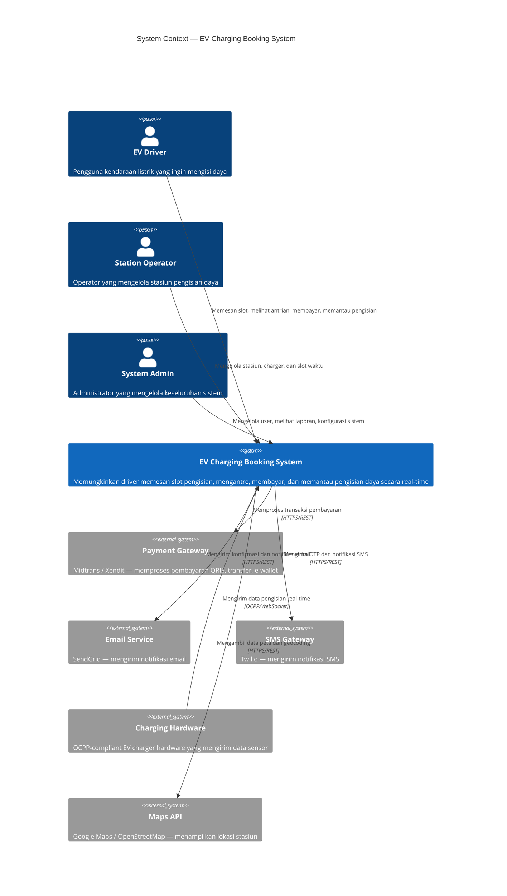

# 01 — System Context Diagram (C4 Level 1)

> **C4 Model — Level 1: System Context**  
> Menunjukkan sistem EV Charging Booking dalam konteks penggunanya dan sistem eksternal.

---

## Diagram

---

## Aktor

### Internal Users

| Aktor | Deskripsi | Akses |
|---|---|---|
| **EV Driver** | Pengguna akhir yang memiliki kendaraan listrik | Mobile/Web App |
| **Station Operator** | Pengelola stasiun pengisian, dapat CRUD stasiun & slot | Web Dashboard |
| **System Admin** | Administrator sistem dengan akses penuh | Admin Panel |

### External Systems

| Sistem | Deskripsi | Protokol |
|---|---|---|
| **Payment Gateway** | Midtrans/Xendit untuk pemrosesan pembayaran | HTTPS REST API |
| **Email Service** | SendGrid untuk pengiriman email transaksional | HTTPS REST API |
| **SMS Gateway** | Twilio untuk SMS OTP dan notifikasi | HTTPS REST API |
| **Charging Hardware** | Hardware charger OCPP untuk telemetri real-time | OCPP 1.6/2.0 via WebSocket |
| **Maps API** | Peta dan geocoding lokasi stasiun | HTTPS REST API |

---

## Use Cases Utama

### EV Driver
1. Daftar & login akun
2. Cari stasiun pengisian terdekat (berdasarkan lokasi/peta)
3. Lihat ketersediaan slot di stasiun
4. Pesan slot pengisian (pilih tanggal, waktu, tipe konektor)
5. Bergabung antrian digital jika slot penuh
6. Bayar booking (QRIS/Transfer/e-Wallet)
7. Pantau status pengisian secara real-time (daya, %, estimasi selesai)
8. Lihat riwayat booking dan pembayaran
9. Batalkan booking (jika masih dalam batas waktu)
10. Terima notifikasi (konfirmasi, pengingat, selesai)

### Station Operator
1. Login ke dashboard operator
2. Tambah/edit/hapus stasiun pengisian
3. Kelola charger per stasiun (tipe konektor, kapasitas)
4. Buat dan kelola slot waktu
5. Lihat booking yang masuk
6. Pantau status semua charger secara real-time
7. Lihat laporan pendapatan

### System Admin
1. Kelola akun pengguna (CRUD, suspend)
2. Lihat semua booking dan transaksi
3. Konfigurasi harga dan kebijakan
4. Monitor health semua service
5. Lihat laporan dan analitik

---

## Constraints & Assumptions

- Sistem mendukung bahasa Indonesia
- Waktu operasional stasiun: 24/7
- Maksimum durasi charging per slot: 4 jam
- Pembayaran harus dilakukan maksimal 30 menit setelah booking dibuat
- Sistem menggunakan Waktu Indonesia Barat (WIB, UTC+7)
- Data sensor charger diterima setiap 10 detik
