# 02 — Container Diagram (C4 Level 2)

> **C4 Model — Level 2: Container Diagram**  
> Menunjukkan teknologi dan tanggung jawab setiap container dalam sistem.

---

## Diagram

```mermaid
C4Container
    title Container Diagram — EV Charging Booking System

    Person(driver, "EV Driver")
    Person(operator, "Station Operator")

    System_Boundary(ev_system, "EV Charging Booking System") {

        Container(frontend, "Web Application", "React 18, TypeScript, Tailwind CSS", "SPA — booking, monitoring, pembayaran, antrean")

        Container(gateway, "API Gateway", "Node.js, Express", "Autentikasi JWT, rate limiting, routing ke service")

        Container(user_svc, "User Service", "Node.js, Express, Sequelize", "Registrasi, login, manajemen profil, JWT issuance")
        Container(station_svc, "Station Service", "Node.js, Express, Sequelize", "CRUD stasiun, charger, slot waktu")
        Container(booking_svc, "Booking Service", "Node.js, Express, Sequelize", "Buat/batalkan booking, saga orchestration")
        Container(queue_svc, "Queue Service", "Node.js, Express, ioredis", "Antrian digital, posisi, dan notifikasi giliran")
        Container(payment_svc, "Payment Service", "Node.js, Express, Sequelize", "Inisiasi dan konfirmasi pembayaran, invoice")
        Container(monitoring_svc, "Monitoring Service", "Node.js, Express, Socket.io, Mongoose", "Telemetri charger, real-time power monitoring")
        Container(notif_svc, "Notification Service", "Node.js, amqplib", "Email, SMS, dan push notification via event")

        ContainerDb(db_users, "Users DB", "PostgreSQL 15", "Data user dan refresh token")
        ContainerDb(db_stations, "Stations DB", "PostgreSQL 15", "Stasiun, charger, slot")
        ContainerDb(db_bookings, "Bookings DB", "PostgreSQL 15", "Booking dan event log")
        ContainerDb(db_payments, "Payments DB", "PostgreSQL 15", "Transaksi dan invoice")
        ContainerDb(db_queue, "Queue Store", "Redis 7", "Antrian realtime dan cache")
        ContainerDb(db_monitoring, "Monitoring DB", "MongoDB 7", "Time-series data sensor charger")

        Container(message_broker, "Message Broker", "RabbitMQ 3.13", "Async event bus antar service")
    }

    System_Ext(payment_gw, "Payment Gateway (Midtrans)")
    System_Ext(email_svc, "Email Service (SendGrid)")
    System_Ext(sms_gw, "SMS Gateway (Twilio)")
    System_Ext(charger_hw, "Charging Hardware (OCPP)")

    Rel(driver, frontend, "Gunakan", "HTTPS")
    Rel(operator, frontend, "Gunakan", "HTTPS")
    Rel(frontend, gateway, "API Calls", "HTTPS/REST + WebSocket")
    Rel(frontend, monitoring_svc, "Real-time data", "WebSocket")

    Rel(gateway, user_svc, "Route /api/auth, /api/users", "HTTP")
    Rel(gateway, station_svc, "Route /api/stations", "HTTP")
    Rel(gateway, booking_svc, "Route /api/bookings", "HTTP")
    Rel(gateway, queue_svc, "Route /api/queue", "HTTP")
    Rel(gateway, payment_svc, "Route /api/payments", "HTTP")
    Rel(gateway, monitoring_svc, "Route /api/monitoring", "HTTP")

    Rel(user_svc, db_users, "Read/Write", "SQL")
    Rel(station_svc, db_stations, "Read/Write", "SQL")
    Rel(booking_svc, db_bookings, "Read/Write", "SQL")
    Rel(booking_svc, station_svc, "Cek slot tersedia", "HTTP internal")
    Rel(booking_svc, user_svc, "Validasi user", "HTTP internal")
    Rel(payment_svc, db_payments, "Read/Write", "SQL")
    Rel(queue_svc, db_queue, "Read/Write", "Redis protocol")
    Rel(monitoring_svc, db_monitoring, "Read/Write", "MongoDB protocol")

    Rel(booking_svc, message_broker, "Publish events", "AMQP")
    Rel(payment_svc, message_broker, "Publish events", "AMQP")
    Rel(monitoring_svc, message_broker, "Publish events", "AMQP")
    Rel(queue_svc, message_broker, "Subscribe & publish", "AMQP")
    Rel(notif_svc, message_broker, "Subscribe events", "AMQP")

    Rel(payment_svc, payment_gw, "Proses transaksi", "HTTPS")
    Rel(notif_svc, email_svc, "Kirim email", "HTTPS")
    Rel(notif_svc, sms_gw, "Kirim SMS", "HTTPS")
    Rel(charger_hw, monitoring_svc, "Kirim telemetri", "OCPP/WebSocket")
```



---

## Penjelasan Setiap Container

### Frontend (Web Application)
- **Teknologi**: React 18 + TypeScript + Tailwind CSS + Vite
- **State Management**: Zustand (global), React Query (server state)
- **Real-time**: Socket.io-client untuk monitoring live
- **Port**: 5173 (dev), 80 (prod)
- **Hosting**: Nginx static file serving

### API Gateway
- **Teknologi**: Node.js + Express + http-proxy-middleware
- **Fungsi**: Single entry point, JWT verification, rate limiting, request logging
- **Tidak ada business logic** — murni routing dan cross-cutting concerns
- **Port**: 3000

### User Service
- **Teknologi**: Node.js + Express + Sequelize + bcrypt + jsonwebtoken
- **Database**: PostgreSQL (dedicated schema)
- **Fungsi**: Register, login, refresh token, profile CRUD
- **Port**: 3001

### Station Service
- **Teknologi**: Node.js + Express + Sequelize
- **Database**: PostgreSQL (dedicated schema)
- **Fungsi**: CRUD stasiun, charger, dan slot waktu; expose internal API untuk service lain
- **Port**: 3002

### Booking Service
- **Teknologi**: Node.js + Express + Sequelize
- **Database**: PostgreSQL (dedicated schema)
- **Fungsi**: Buat/lihat/batalkan booking; publish event ke RabbitMQ; koordinasi saga
- **Port**: 3003

### Queue Service
- **Teknologi**: Node.js + Express + ioredis
- **Database**: Redis (Sorted Sets untuk antrian berurut)
- **Fungsi**: Join/leave antrian, cek posisi, notifikasi saat giliran
- **Port**: 3004

### Payment Service
- **Teknologi**: Node.js + Express + Sequelize
- **Database**: PostgreSQL (dedicated schema)
- **External**: Midtrans / Xendit API
- **Fungsi**: Inisiasi pembayaran, webhook konfirmasi, invoice, refund
- **Port**: 3005

### Monitoring Service
- **Teknologi**: Node.js + Express + Socket.io + Mongoose
- **Database**: MongoDB (time-series data)
- **Fungsi**: Terima data OCPP dari hardware, simpan telemetri, broadcast ke client via WebSocket
- **Port**: 3006

### Notification Service
- **Teknologi**: Node.js + amqplib (event consumer)
- **External**: SendGrid, Twilio
- **Fungsi**: Consumer RabbitMQ — kirim email/SMS/push berdasarkan event bisnis
- **Port**: 3007 (hanya health check endpoint)

---

## Network Topology

```
[Internet] ──► [Nginx :80/443] ──► [Frontend :5173]
                                └─► [API Gateway :3000]
                                          │
                    ┌─────────────────────┼──────────────────────┐
                    ▼                     ▼                       ▼
              [User Svc :3001]   [Station Svc :3002]   [Booking Svc :3003]
              [PG: ev_users]     [PG: ev_stations]      [PG: ev_bookings]
                                                              │
                    ┌─────────────────────┼──────────────────┐
                    ▼                     ▼                   ▼
            [Queue Svc :3004]   [Payment Svc :3005]  [Monitor Svc :3006]
            [Redis]             [PG: ev_payments]     [MongoDB]
                    │                     │                   │
                    └─────────────────────┼───────────────────┘
                                          ▼
                                    [RabbitMQ :5672]
                                          │
                                          ▼
                                  [Notif Svc :3007]
```

---

## Inter-Service Communication Matrix

| From → To | Protocol | Type | Endpoint |
|---|---|---|---|
| Gateway → All Services | HTTP/REST | Sync | Proxy routing |
| Booking → Station | HTTP/REST | Sync | GET /internal/slots/:id |
| Booking → User | HTTP/REST | Sync | GET /internal/users/:id |
| Booking → RabbitMQ | AMQP | Async | Exchange: booking |
| Payment → RabbitMQ | AMQP | Async | Exchange: payment |
| Monitoring → RabbitMQ | AMQP | Async | Exchange: monitoring |
| Queue ← RabbitMQ | AMQP | Async | Queue: queue-service |
| Notification ← RabbitMQ | AMQP | Async | Queue: notification-service |
| Frontend → Monitoring | WebSocket | Persistent | ws://.../live/:id |
