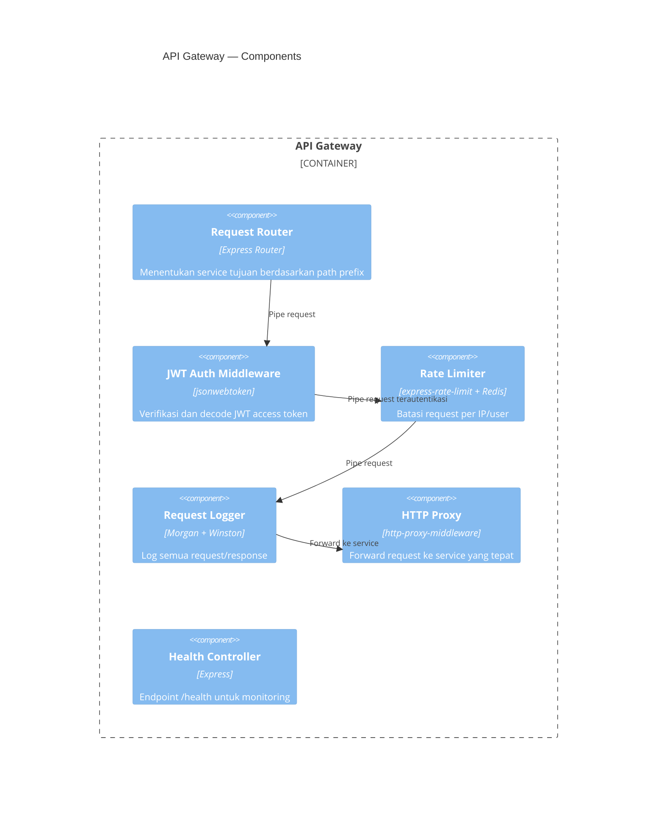
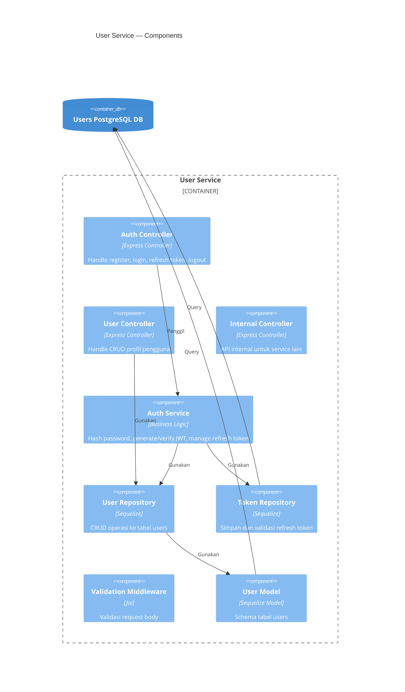
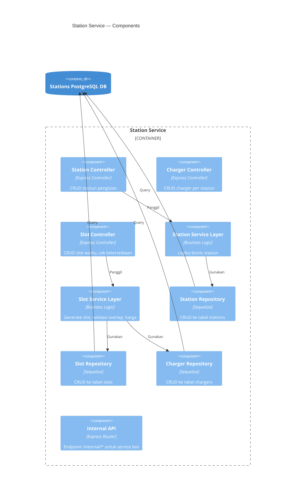
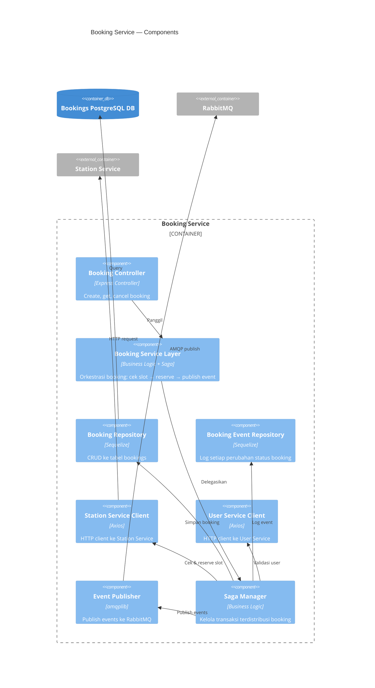
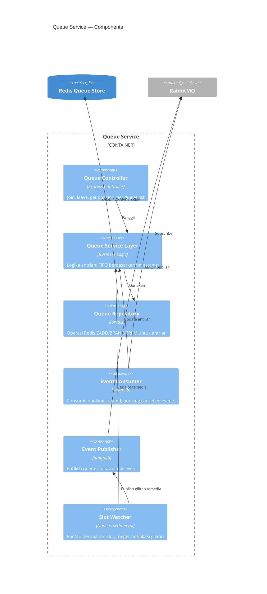
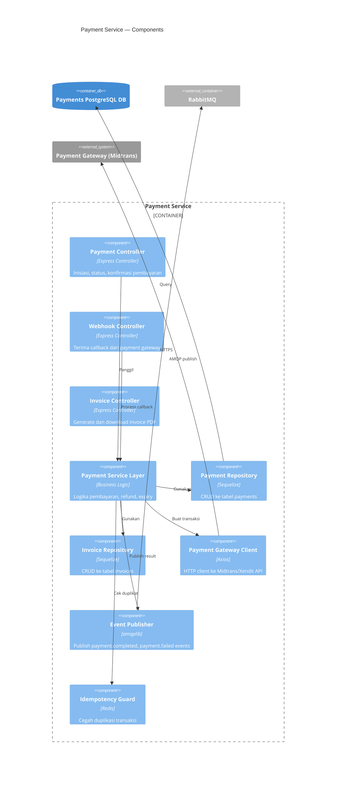
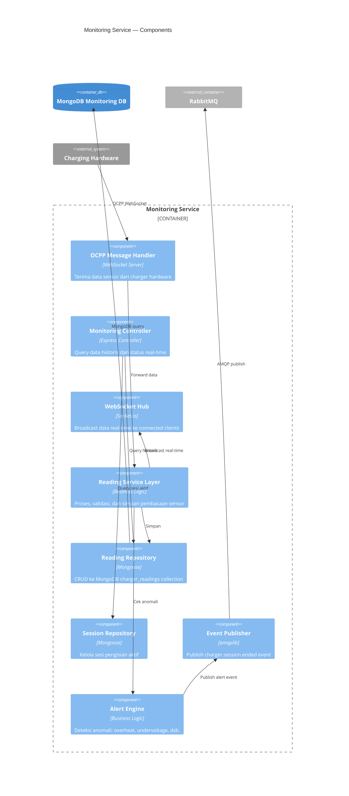
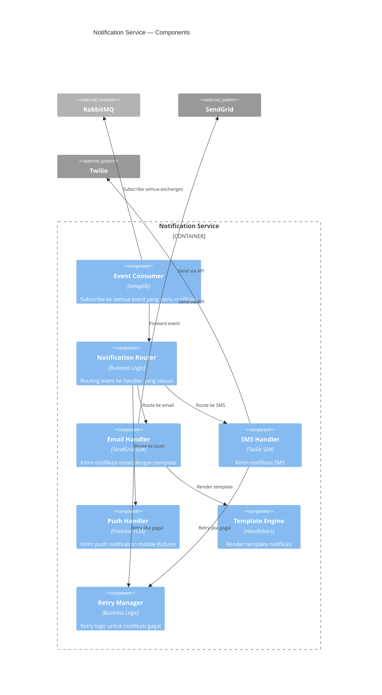

# 03 — Component Diagrams (C4 Level 3)

> **C4 Model — Level 3: Component Diagram**  
> Menampilkan komponen internal setiap service.

---

## 3.1 API Gateway — Komponen Internal

---

## 3.2 User Service — Komponen Internal

---

## 3.3 Station Service — Komponen Internal

---

## 3.4 Booking Service — Komponen Internal

---

## 3.5 Queue Service — Komponen Internal

---

## 3.6 Payment Service — Komponen Internal

---

## 3.7 Monitoring Service — Komponen Internal

---

## 3.8 Notification Service — Komponen Internal

