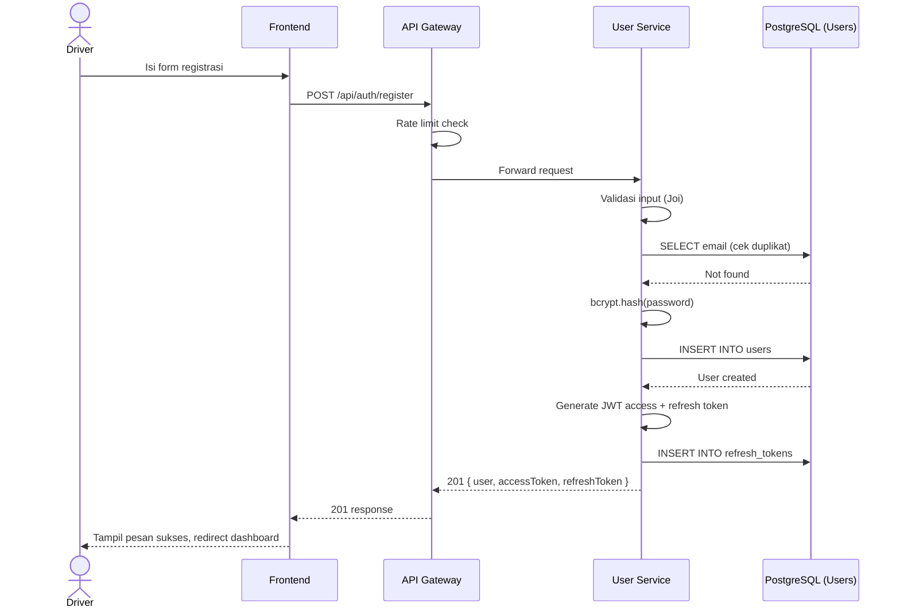
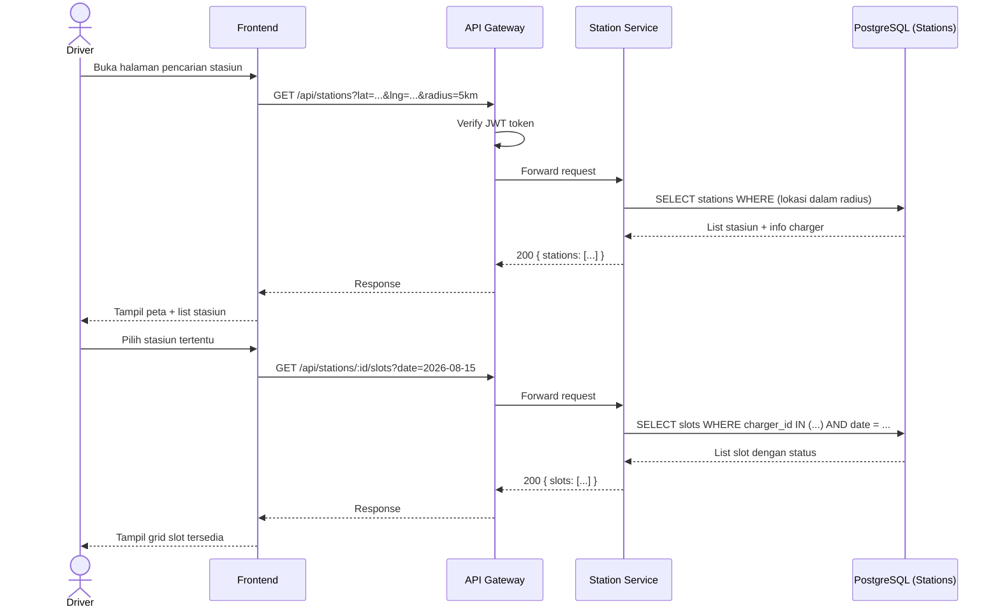
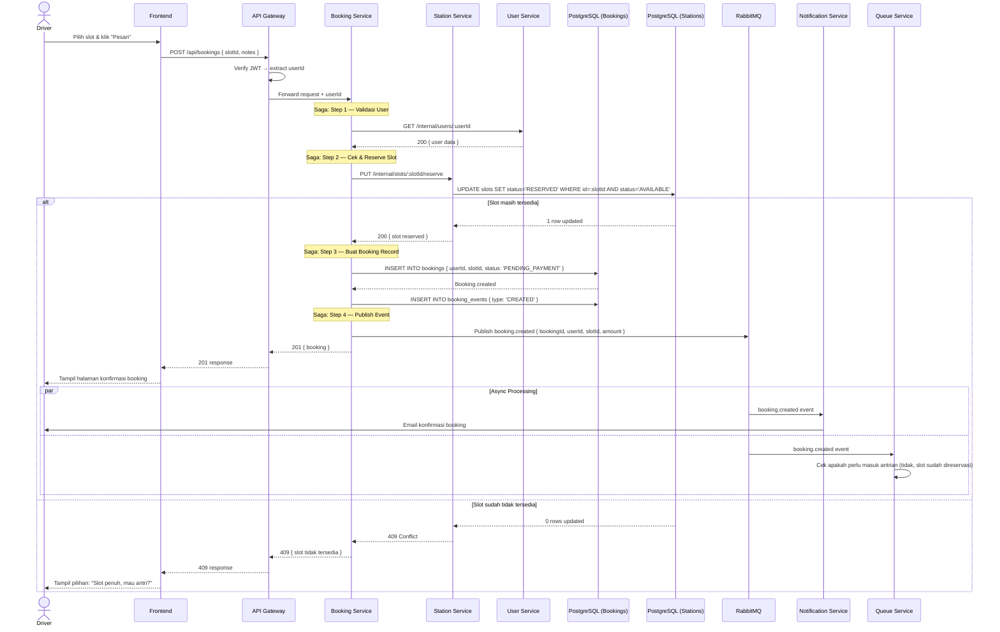
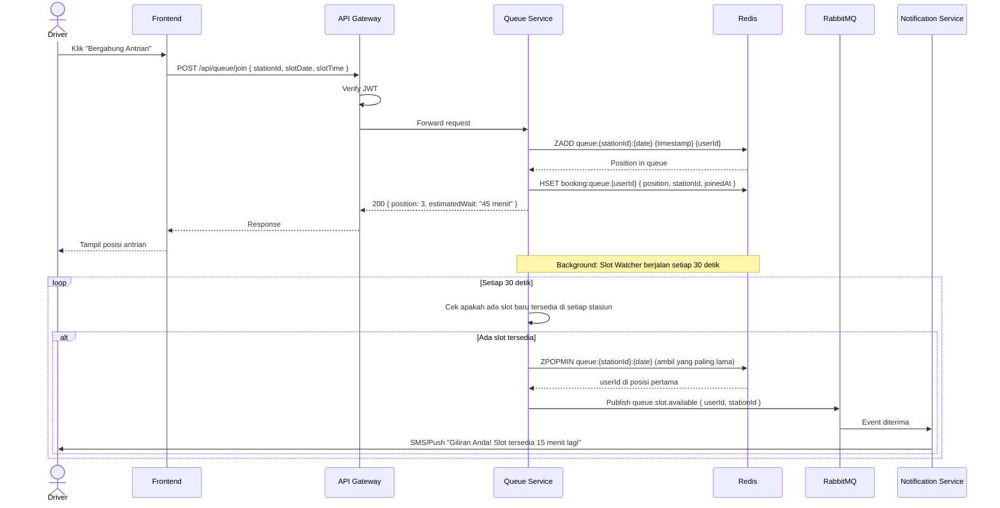
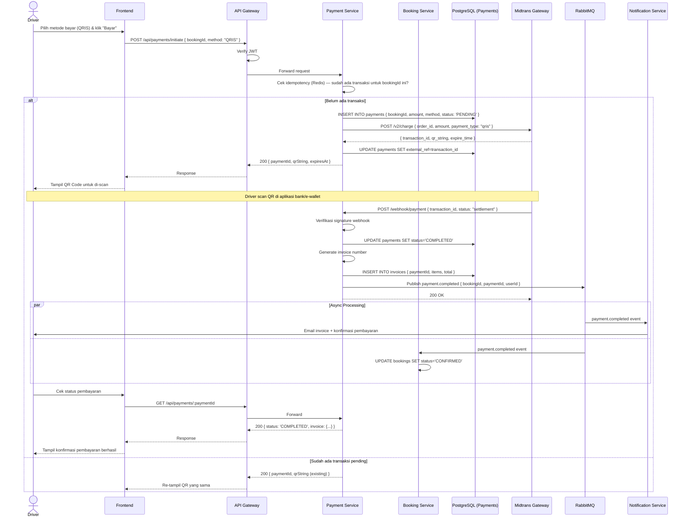
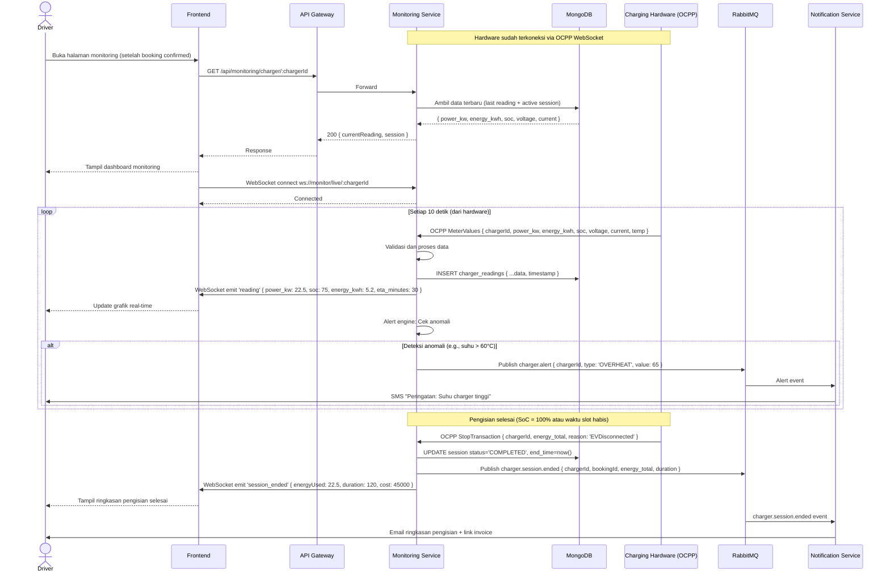
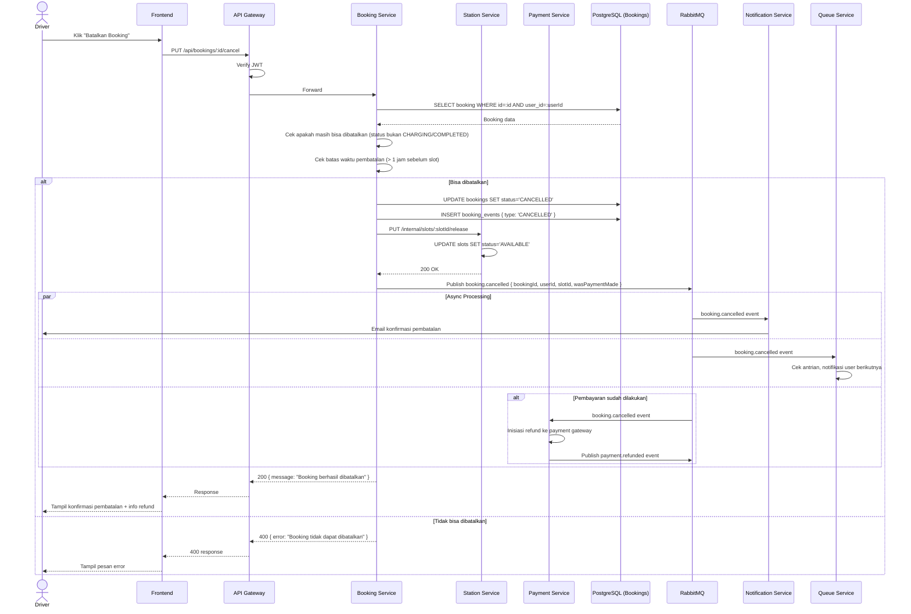

# 04 — Sequence Diagrams

> Diagram urutan untuk alur bisnis utama dalam sistem EV Charging Booking.

---

## 4.1 Alur Registrasi & Login

---

## 4.2 Alur Mencari & Memilih Stasiun

---

## 4.3 Alur Booking Slot (Happy Path)

---

## 4.4 Alur Bergabung Antrian

---

## 4.5 Alur Pembayaran

---

## 4.6 Alur Real-time Monitoring Pengisian Daya

---

## 4.7 Alur Pembatalan Booking

